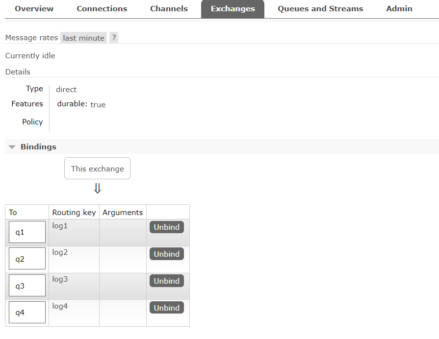
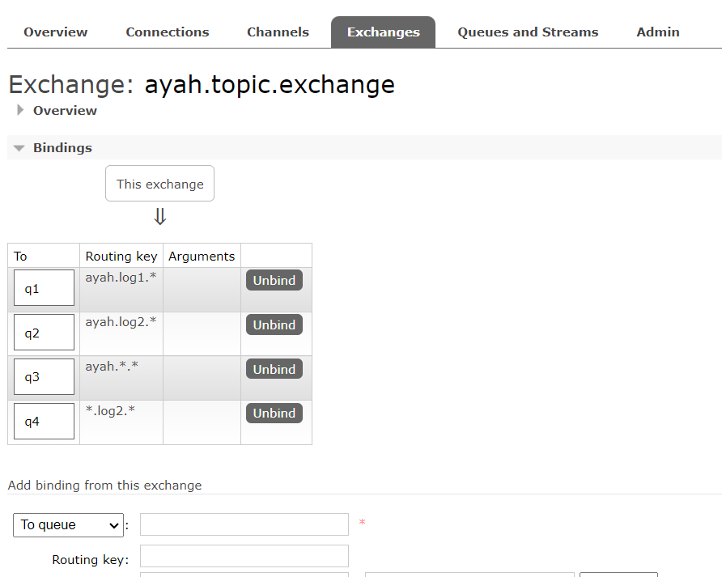
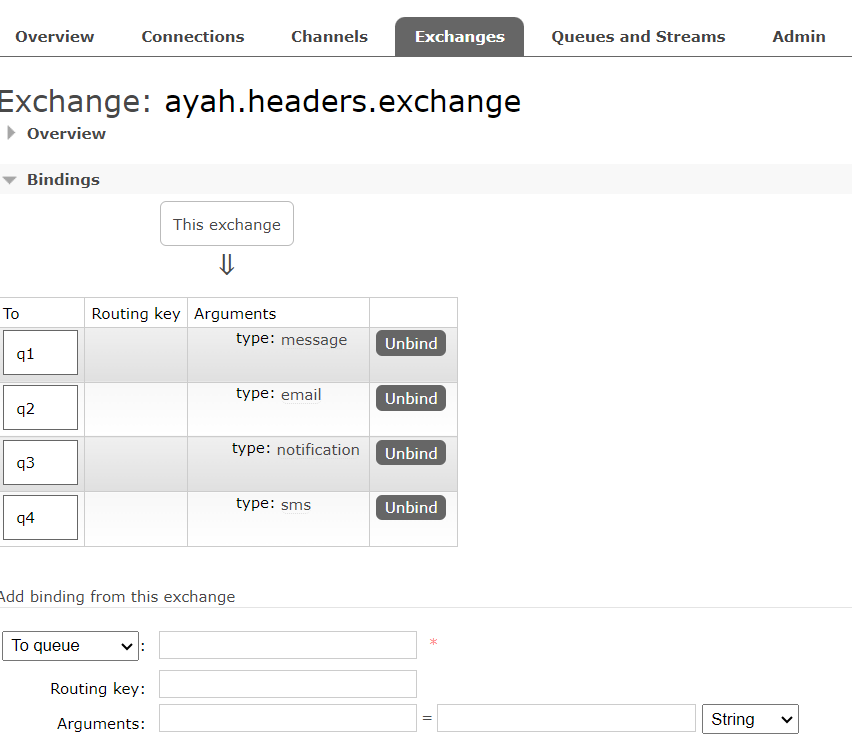
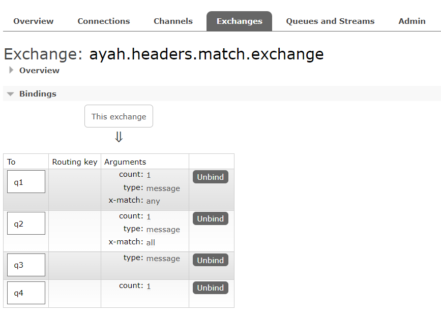
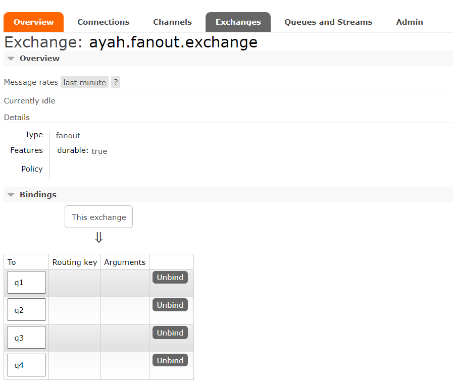

# Getting Started

### RabbitMQ Docker Image

```powershell
docker run -d --name rabbitmq -p 5672:5672 -p 15672:15672 -e RABBITMQ_DEFAULT_USER=userName -e RABBITMQ_DEFAULT_PASS=password rabbitmq:3.12-management
```
then run docker image.

### Update application.properties File
update the following prop in application.properties

```properties
spring.rabbitmq.host=localhost
spring.rabbitmq.port=port
spring.rabbitmq.username=username
spring.rabbitmq.password=password
```

### RabbitMq After Run Application


---

---

---

---


### Direct Exchange Examples

#### Example 1
```bash
curl --location 'http://localhost:8088/direct-exchange?message=hello%20world1&routingKey=log1'
```

```text
Message: hello world1 RoutingKey: log1
q1 ------------> Received Message: hello world1
```

#### Example 2
```bash
curl --location 'http://localhost:8088/direct-exchange?message=hello%20world2&routingKey=log2'
```

```text
Message: hello world2 RoutingKey: log2
q2 ------------> Received Message: hello world2
```

#### Example 3
```bash
curl --location 'http://localhost:8088/direct-exchange?message=hello%20world3&routingKey=log3'
```

```text
Message: hello world3 RoutingKey: log3
q3 ------------> Received Message: hello world3
```

#### Example 4
```bash
curl --location 'http://localhost:8088/direct-exchange?message=hello%20world4&routingKey=log4'
```

```text
Message: hello world4 RoutingKey: log4
q4 ------------> Received Message: hello world4
```

#### Example 5
```bash
curl --location 'http://localhost:8088/direct-exchange?message=hello%20world5&routingKey=log5'
```

```text
Message: hello world5 RoutingKey: log5
```

### Topic Exchange Examples

#### Example 1
```bash
curl --location 'http://localhost:8088/topic-exchange?message=hello%20world&routingKey=ayah.log1.log'
```

```text
Message: hello world RoutingKey: ayah.log1.log
q3 ------------> Received Message: hello world
q1 ------------> Received Message: hello world
```

#### Example 2
```bash
curl --location 'http://localhost:8088/topic-exchange?message=hello%20world&routingKey=ayah.log2.log'
```

```text
Message: hello world RoutingKey: ayah.log2.log
q4 ------------> Received Message: hello world
q2 ------------> Received Message: hello world
q3 ------------> Received Message: hello world
```

### Headers Exchange Example

#### Example 1
```bash
curl --location 'http://localhost:8088/header-exchange?message=hello%20world&type=email'
```

```text
Message: hello world Type: email
q2 ------------> Received Message: hello world
```

#### Example 2

```bash
curl --location 'http://localhost:8088/header-exchange?message=hello%20world&type=message'
```

```text
Message: hello world Type: message
q1 ------------> Received Message: hello world
```

#### Example 3
```bash
curl --location 'http://localhost:8088/header-exchange?message=hello%20world&type=notification'
```

```text
Message: hello world Type: notification
q3 ------------> Received Message: hello world
```

#### Example 4
```bash
curl --location 'http://localhost:8088/header-exchange?message=hello%20world&type=sms'
```

```text
Message: hello world Type: sms
q4 ------------> Received Message: hello world
```

#### Example 5
```bash
curl --location 'http://localhost:8088/header-exchange?message=hello%20world&type=mms'
```

```text
Message: hello world Type: mms
```

### Headers Exchange With x-match Example

#### Example 1
```bash
curl --location 'http://localhost:8088/header-exchange-x-match?message=hello%20world&type=message&count=0'
```

```text
Message: hello world Type: message Count: 0
q3 ------------> Received Message: hello world
q1 ------------> Received Message: hello world
```

#### Example 2

```bash
curl --location 'http://localhost:8088/header-exchange-x-match?message=hello%20world&type=sms&count=1'
```

```text
Message: hello world Type: sms Count: 1
q1 ------------> Received Message: hello world
q4 ------------> Received Message: hello world
```

#### Example 3
```bash
curl --location 'http://localhost:8088/header-exchange-x-match?message=hello%20world&type=message&count=1'
```

```text
Message: hello world Type: message Count: 1
q2 ------------> Received Message: hello world
q1 ------------> Received Message: hello world
q3 ------------> Received Message: hello world
q4 ------------> Received Message: hello world
```

#### Example 4
```bash
curl --location 'http://localhost:8088/header-exchange-x-match?message=hello%20world&type=sms&count=0'
```

```text
Message: hello world Type: sms Count: 0
```

### Fanout Exchange Example

#### Example 1
```bash
curl --location 'http://localhost:8088/fanout-exchange?message=hello%20world'
```

```text
Message: hello world
q1 ------------> Received Message: hello world
q4 ------------> Received Message: hello world
q2 ------------> Received Message: hello world
q3 ------------> Received Message: hello world
```

### DEAD LETTER Exchange Example

#### Example 1
```bash
curl --location 'http://localhost:8088/direct-exchange?message=deadLetterMessage&routingKey=log5'
```

```text
Message: deadLetterMessage RoutingKey: log5
q5 ------------> Received Message: deadLetterMessage
q5 ------------> Reject Message
2023-12-29T21:15:40.839+03:00  WARN 15876 --- [ntContainer#5-1] s.a.r.l.ConditionalRejectingErrorHandler : Execution of Rabbit message listener failed.

org.springframework.amqp.rabbit.support.ListenerExecutionFailedException: Listener method 'public void com.rabbitmq.example.consumer.Consumer.receiveMessage5(java.lang.String)' threw exception
	at org.springframework.amqp.rabbit.listener.adapter.MessagingMessageListenerAdapter.invokeHandler(MessagingMessageListenerAdapter.java:286) ~[spring-rabbit-3.1.1.jar:3.1.1]
	at org.springframework.amqp.rabbit.listener.adapter.MessagingMessageListenerAdapter.invokeHandlerAndProcessResult(MessagingMessageListenerAdapter.java:224) ~[spring-rabbit-3.1.1.jar:3.1.1]
	at org.springframework.amqp.rabbit.listener.adapter.MessagingMessageListenerAdapter.onMessage(MessagingMessageListenerAdapter.java:149) ~[spring-rabbit-3.1.1.jar:3.1.1]
	.
	.
	.
	at org.springframework.messaging.handler.invocation.InvocableHandlerMethod.invoke(InvocableHandlerMethod.java:119) ~[spring-messaging-6.1.2.jar:6.1.2]
	at org.springframework.amqp.rabbit.listener.adapter.HandlerAdapter.invoke(HandlerAdapter.java:75) ~[spring-rabbit-3.1.1.jar:3.1.1]
	at org.springframework.amqp.rabbit.listener.adapter.MessagingMessageListenerAdapter.invokeHandler(MessagingMessageListenerAdapter.java:277) ~[spring-rabbit-3.1.1.jar:3.1.1]
	... 15 common frames omitted

deadLetter ------------> Received Message: deadLetterMessage
```